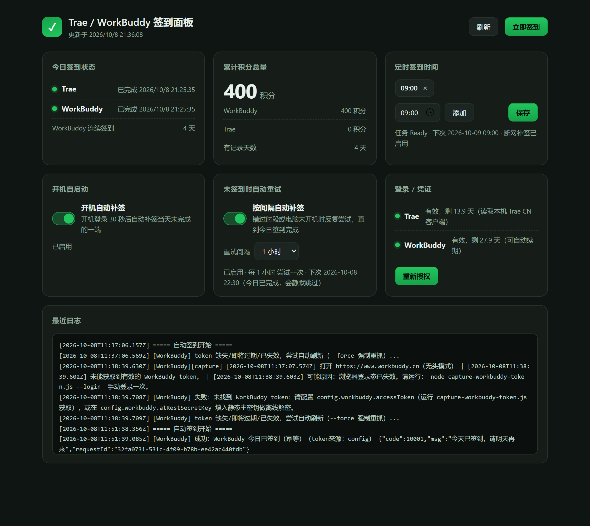

# Trae / WorkBuddy 签到助手

> Windows 上为 **Trae CN** 与 **WorkBuddy** 自动领取每日免费积分，并附带一个本地 Web 面板。



---

## 这是什么

每天都要在 Trae CN 和 WorkBuddy 上各点一次「签到」才能领到免费积分，忘了就断签。这个工具把这件事变成后台自动完成：

- **零运行时依赖** —— 全部代码只用 Node 内置模块（`crypto` / `fetch` / `http`），**不需要 `npm install`**
- **不碰你的密码** —— 只读本机客户端的登录态，或走官方授权流
- **不伪造设备** —— 没有 MITM 代理、不装根证书、不改注册表、不伪造 `x-device-id`
- **幂等** —— 以「账号 × 端」为单位：某账号的某一端当天签到成功后，后续所有触发都会静默跳过，不会重复领取

## 功能

| 功能 | 说明 |
| --- | --- |
| 自动签到 | Trae CN + WorkBuddy 每日签到领积分 |
| 多账号 | 一个 `config.json` 管多个账号；每个账号单独开关 Trae / WorkBuddy、单独授权、单独看积分 |
| 批量签到 | 面板勾选账号后一次提交，或 `node checkin.js --accounts id1,id2`；账号之间自动间隔（默认 1.5 秒） |
| 本地面板 | 账号管理 / 今日状态 / 累计积分 / 定时时段 / 开机自启 / 未签到时重试 / 凭证有效期 / 日志（可一键导出、清除） |
| 四层兜底 | 定时时段 → 断网补签 → 开机补签 → 每小时重试 |
| 系统通知 | 成功每日一条汇总（多账号合并为一条）；失败与漏签必定提醒 |

---

## 快速开始

### 0. 安装（推荐：下载安装包）

从 [Releases](https://github.com/b-as-h/Trae-WorkBuzzer-/releases) 下载 `TraeCheckin-Setup-vX.Y.Z.exe`，双击安装即可 —— **自带 Node 运行时，无需安装 Node.js**：

- 安装到 `%LOCALAPPDATA%\Programs\TraeCheckin`（免管理员），建议勾选「注册计划任务」
- 桌面快捷方式为可选项；开始菜单含「打开签到面板 / 状态总览 / 手动签到一次」
- **升级**：直接运行新版安装包覆盖，`config.json`（凭证）与签到状态不会被覆盖
- **卸载**：设置 → 应用 →「Trae 签到助手」；计划任务只在指向本安装时才被注销，账号凭证默认保留

从源码运行则继续看下面（需要 Node.js ≥ 18）。

### 环境要求

- Windows 10 / 11
- **Node.js ≥ 18**（从源码运行才需要；安装包自带运行时）
- 已安装并登录 **Trae CN 客户端**（只管理本机这一个 Trae 账号时无需其它配置；多个 Trae 账号见「多账号管理」）
- 一个或多个 WorkBuddy 账号（每个账号单独授权一次）

> 没有 `npm install` 这一步 —— 项目零依赖。

### 1. 从源码部署

```powershell
git clone https://github.com/b-as-h/Trae-WorkBuzzer-.git
cd Trae-WorkBuzzer-
Copy-Item config.example.json config.json
node checkin.js        # 先手动跑一次，确认 Trae 端能签到
```

Trae 端的凭证会自动从本机 Trae CN 客户端读取，**无需任何配置**。

### 2. WorkBuddy 授权（每个账号一次性）

```powershell
node wb-auth.js login                            # 只有一个账号时可省略 --account
node wb-auth.js login --account <账号ID|名称>     # 多账号：为指定账号授权
```

终端会打印一个链接，在浏览器里用**该账号**确认授权即可。拿到的是官方 Keycloak JWT（约 28 天有效），之后由 `refreshToken` 自动滚动续期，**不需要再手动操作**。

授权是**按账号**的：一个账号在浏览器里确认一次，令牌只写进那个账号；多账号时必须用 `--account` 指明对象（也可以直接在面板的「账号管理」里点按钮授权）。`ensure` 不带 `--account` 时刷新所有启用 WorkBuddy 的账号，`status` 列出全部账号的凭证状态。

### 3. 注册计划任务

```powershell
powershell -ExecutionPolicy Bypass -File .\register-task.ps1
```

### 4. 打开面板

双击 `ui.cmd`，或直接访问 <http://127.0.0.1:8795/>

面板只监听 `127.0.0.1`，不对外暴露；接口也不会返回明文凭证。

---

## 多账号管理

多账号配置全部落在 `config.json` 的 `accounts` 数组里，每个账号一项：

```json
{
  "accounts": [
    {
      "id": "acc-1a2b3c4d",
      "name": "主账号",
      "enabled": true,
      "trae": { "enabled": true, "manualToken": "", "deviceId": "" },
      "workbuddy": { "enabled": true, "accessToken": "", "refreshToken": "", "uid": "", "domain": "" }
    }
  ],
  "trae": { "host": "https://api.trae.cn", "region": "CN" },
  "workbuddy": {}
}
```

- `id` 是稳定标识，`state` 与日志按它归属；`name` 只是面板上的显示名，可随时改（改名不影响签到记录）。
- 顶层的 `trae` 是**全局默认值**（`host` / `region` / 存储路径 / 重试参数），会被账号自己的 `trae` 块覆盖；顶层的 `workbuddy` 是 v1 的旧凭证槽位，迁移后为空。
- `enabled: false`（面板上点「停用」）只让该账号退出签到，**凭证保留**，随时可以再启用。

### 添加账号与分别授权

1. 面板「账号管理」→「添加账号」。新账号默认**只开 WorkBuddy**（Trae 需要显式填 token + 设备 ID，见下）。
2. 点该账号行的「WorkBuddy 授权」：浏览器里用**这个账号**确认一次，令牌只写进它。一个账号确认一次，不存在「一次授权覆盖多个账号」。
3. 每个账号都有独立的「参与 Trae / 参与 WorkBuddy」开关，也有独立的「Trae 今日 / WorkBuddy 今日」和积分统计。

### Trae 的第二个账号：为什么要填 token + 设备 ID

默认情况下 Trae 的登录态来自**本机客户端** `storage.json`，所以本机登录的那个 Trae 账号不用配置任何东西。但一台机器只有一个客户端登录态，其它 Trae 账号必须在它的「Trae 凭证」里填两项：

- **Trae Token** —— 该账号的 Cloud-IDE token；
- **设备 ID** —— 这个 token 所属账号的 aha 设备 ID，也就是 `storage.json` 里键名 `iCubeAuthInfo://icube-dc:<数字>` 的**数字部分**。

两项必须属于**同一个账号**。填了 token 之后这个账号就**只认这个 token**，不会与本机客户端登录态按「谁有效期长」择优混用 —— 否则会拿另一个账号去签到。只填 token、设备 ID 却回落到本机客户端时，接口会持续返回 `9074`（它伪装成「高峰期 / 参与用户太多」）—— 这时脚本重试 3 次就会直接报错并说明原因，避免在批量签到时白等满 8 分钟的重试时限。填写 token 会自动打开该账号的 Trae 参与开关；两项都留空保存 = 清除手动凭证并关闭该端。

**怎么拿到这两个值** —— 用配套工具 `get-trae-creds.js`（零依赖，复用本项目的解密实现）：

```powershell
node get-trae-creds.js                      # 本机客户端的 storage.json
node get-trae-creds.js D:\copy\storage.json # 登录了该账号的机器上拷过来的 storage.json
node get-trae-creds.js --mask               # 只看指纹，不打印 token 本体
# 不想开命令行也可以直接双击 get-trae-creds.cmd（自动切到项目目录，跑完停住不闪退）
```

输出的 token + 设备 ID 直接粘进面板该账号的「Trae 凭证」表单即可。三条注意：

- **不要把本机 Trae CN 客户端换登成别的账号**去拿凭证 —— 本机登录态是「默认账号」的凭证来源，换登会把它顶掉。稳妥做法：在另一台电脑/虚拟机登录该账号后运行本工具，或把那份 `storage.json` 拷过来指定路径。
- Cloud-IDE JWT 约 **14 天**过期，**只有该账号的客户端保持登录时才会自动续**；第二个账号的 token 到期后需要重新提取一次 —— 这是 Trae 多账号目前的固有约束（没有可用的官方刷新端点，与 WorkBuddy 的 `refreshToken` 不同）。
- token 与设备 ID **必须来自同一份** `storage.json`（同一账号），否则接口持续返回 `9074`。

> 多个账号如果都回落到同一个本机 Trae 登录态，其实还是同一个 Trae 账号：第二个账号会被跳过，并在日志里写明「与账号「x」共用同一 Trae 登录态」，不再重复打接口。

### 批量签到

| 方式 | 用法 |
| --- | --- |
| 面板 | 勾选账号 →「批量签到（选中 N 个）」。**一个都不勾 = 全部启用账号**；同步顺序执行，单次最长等待 15 分钟（账号越多越久，进度看「最近日志」） |
| 命令行 | `node checkin.js`（全部启用账号）/ `node checkin.js --accounts id1,id2` / `node checkin.js --account id1 --account id2` |

`--accounts` / `--account` 也接受**账号名**；只跑指定账号时，日志横幅与通知报的也是这一部分账号。账号之间默认间隔 `batch.intervalMs`（默认 1500 ms，可用环境变量 `CHECKIN_BATCH_INTERVAL_MS` 覆盖），避免瞬间并发把自己变成风控特征。批量签到沿用当日幂等：**已完成的「账号 × 端」自动跳过**，排障要强制重跑请加 `--force`。

### 停用与删除

| 操作 | 语义 |
| --- | --- |
| 停用 | 该账号不再参与签到与补签，**凭证保留**（配置与历史都还在），随时可启用 |
| 删除 | 连凭证一起删除（不可恢复），并清掉它的当日状态；面板会二次确认 |

---

## 计划任务

| 任务名 | 触发 | 作用 | 面板可控 |
| --- | --- | --- | --- |
| `DailyCheckin` | 你设定的时段 | 主定时签到 | 时段可改 |
| `DailyCheckinOnNet` | 网络恢复（事件 10000） | 断网补签 | — |
| `DailyCheckinOnLogon` | 登录后 30 秒 | 开机补签 | ✅ |
| `DailyCheckinHourly` | 每 N 小时 | 兜底重试 | ✅ |

四个任务都带 `StartWhenAvailable`：错过的时段会在下次开机时补跑。

四个脚本无需为多账号做任何改动 —— 它们仍然调用同一个 `checkin.js`，后者会自动遍历所有启用账号的每个参与端（「账号 × 端」）。

重试任务以 `--quiet-skip` 运行 —— **所有目标账号的所有端都已完成**时，`checkin.js` 会在抢锁与写日志之前直接返回，因此它可以全天候常驻：**当日全部完成则零日志、零网络请求**。

---

## 目录结构

```
.
├── checkin.js              签到主程序（零依赖）
├── wb-auth.js              WorkBuddy 官方插件授权流（login / refresh / ensure / status）
├── get-trae-creds.js       从任意 storage.json 提取 Trae token + 设备 ID（多账号配套）
├── server.js               面板后端（node:http，仅 127.0.0.1:8795）
├── status.js / status.cmd  命令行状态查看（面板的 CLI 版本）
├── ui/
│   └── index.html          面板前端（单文件，原生 JS）
├── ui.cmd                  面板入口：已在运行则直接开浏览器，否则隐藏启动
├── run-panel.vbs           面板隐藏窗口启动器
├── run-hidden.vbs          签到任务隐藏窗口启动器
├── checkin.cmd              手动签到入口（安装包/双击用，自动选运行时）
├── installer/
│   ├── Setup.iss            Inno Setup 安装脚本
│   └── ChineseSimplified.isl 中文向导语言文件（来自官方 issrc）
├── build/
│   └── build.ps1            构建安装包（暂存 + 编译，产物在 build/dist/）
├── probe.ps1               面板就绪探测（原生 TCP，毫秒级）
├── register-task.ps1       注册 Windows 计划任务
├── notify-toast.ps1        系统通知
├── lib/
│   ├── accounts.js         账号模型与旧配置迁移（accounts 数组 / default 合成账号）
│   ├── trae.js             Trae 凭证解密与签到（支持账号级 token + 设备 ID）
│   ├── workbuddy.js        WorkBuddy 签到
│   ├── daily-state.js      当日状态（按「账号 × 端」幂等跳过）
│   ├── net.js              断网等待与探测
│   └── notify.js           通知编排
├── assets/checkin.ico      图标
└── docs/
    ├── PROVENANCE.md       来源与许可说明
    ├── architecture.md     架构说明
    └── images/panel.png    面板截图
```

运行时产物（全部已在 `.gitignore` 中排除）：

```
config.json                  accounts 数组（每个账号的凭证）+ 全局默认值，等价于密码
state/daily-status.json      当日签到状态（按账号分槽）
state/credits-history.json   积分历史（每天含 byAccount，按账号拆分）
state/panel.json             面板设置
.wb-browser-profile/         WorkBuddy 浏览器登录态
checkin.log / wb-auth.log    日志
```

---

## 数据与迁移

### config.json：accounts 与顶层 trae / workbuddy

| 位置 | 含义 |
| --- | --- |
| `accounts[]` | 账号列表。每项 `{ id, name, enabled, trae{…}, workbuddy{…} }`；**凭证只存在这里** |
| 顶层 `trae` | 全局默认值（`host` / `region` / `storageJson` / 重试参数），被账号级 `trae` 覆盖 |
| 顶层 `workbuddy` | v1 的旧单账号凭证槽位；迁移后清空 |
| `batch.intervalMs` | 批量签到的账号间隔（默认 `1500` 毫秒） |
| `networkRetry` / `crossDayGuard` / `notify` | 与 v1 相同的全局开关 |

### 旧配置自动迁移（无需人工改动）

1. `config.json` 里没有非空 `accounts` 数组时，`lib/accounts.js` 会**合成**一个账号：ID 固定为 `default`、名为「默认账号」，WorkBuddy 凭证取自顶层 `workbuddy`。老安装因此一行配置都不用改就能继续跑。
2. 面板或 CLI（`wb-auth.js`）**第一次需要写配置**时，才把合成账号真正写进 `accounts`，并把顶层 `workbuddy` 清空 —— 凭证只留一份，不会出现两处不同步。
3. 固定 ID `default` 是刻意的：旧版 `state/daily-status.json` 的扁平结构也映射到 `default`，所以**升级当天「今天已经签过」的记忆不会丢，不会因为升级重复签到**。

> ⚠️ 迁移之后**不要手工删除 `accounts`（或把它清空）**：凭证只存在账号里，删掉就等于把登录态一起丢掉，只能重新授权。

### state/daily-status.json

```json
{
  "date": "2026-10-08",
  "accounts": {
    "default": { "name": "默认账号", "trae": { "ok": true, "at": "…" }, "workbuddy": { "ok": true, "at": "…" } }
  },
  "notify": { "successAt": "…", "failureKey": "…" },
  "updatedAt": "…"
}
```

- 只有 `ok === true` 才算「今日已完成」；失败记录在读取时会被清掉，那一端下一时段照常重试。
- 旧版扁平结构 `{ date, workbuddy, trae }` 读取时自动映射到 `default` 账号；日期不是今天则整体重置（跨天）。

### 备份建议

`config.json` 等价于密码（含 `accessToken` / `refreshToken` / Trae token）：**不要为了"整理"手工裁剪它**。要备份就整份 `config.json` + `state/` 一起备份，并且别提交、别分享、别放云盘 —— `.gitignore` 已排除它们。

---

## 面板 API

| 方法 | 路径 | 说明 |
| --- | --- | --- |
| GET | `/` | 面板页面 |
| GET | `/api/ping` | 存活探测（轻量，毫秒级） |
| GET | `/api/status` | 汇总状态：`accountCount` / `enabledCount` / `doneCount` / `accounts[]`（每账号含 `sides` / `today` / `credits` / `creds` / `live`），以及签到 / 积分 / 定时 / 自启 / 重试 |
| GET | `/api/accounts` | 账号列表（与 `/api/status` 的 `accounts[]` 同结构，不做 WorkBuddy 实时查询） |
| POST | `/api/accounts` | 账号增删改：`action = add` / `rename` / `enable` / `sides` / `trae-token` / `remove`；返回最新账号列表 |
| POST | `/api/checkin` | 立即签到：`body.accounts = [账号ID]` 指定范围（省略 = 全部启用账号），可带 `body.force` |
| GET | `/api/log` | 日志尾部（`?lines=N`） |
| GET | `/api/log/export` | 下载完整 `checkin.log` 附件（文件名带时间戳；不含轮转存档） |
| POST | `/api/log/clear` | 清除 `checkin.log` 及其全部轮转存档（不可恢复；积分历史单独存储，不受影响） |
| POST | `/api/schedule` | 设置每日触发时段 |
| POST | `/api/autostart` | 开机自动补签 开/关 |
| POST | `/api/hourly` | 未签到时按间隔重试 开/关 + 间隔 |
| POST | `/api/wb-login/start` | 发起**指定账号**的 WorkBuddy 授权（`body.accountId`），返回授权链接 |
| GET | `/api/wb-login/poll` | 轮询授权结果（`?accountId=`），成功后令牌写回该账号 |

> 兼容字段：`/api/status` 仍保留 v1 的 `today` / `workbuddyLive` / `creds` / `credits`，一律指向**第一个账号**（`credits` 是全局合计），旧脚本无需改动。

---

## 凭证是怎么拿到的

### Trae CN

直接解密客户端 `storage.json` 里的 `iCubeAuthInfo`（`"tc"` 格式：AES-128-CBC + SHA-512 密钥派生 + HMAC 校验）。**全程只读**，不修改客户端任何文件。

token 约 **14 天**过期，由桌面客户端自行续期。

> ⚠️ **不要主动调用续期接口。** 续期会轮换 `refreshToken`，抢跑会导致你在 Trae CN 客户端上被迫重新登录。状态页提示「即将过期」时，打开一次客户端即可。

### WorkBuddy

走**官方插件授权流**（OAuth 设备授权），四个端点：

```
POST /v2/plugin/auth/state?platform=workbuddy   ->  state + authUrl
GET  /v2/plugin/auth/token?state=<state>        ->  accessToken / refreshToken / domain
GET  /v2/plugin/login/account?state=<state>     ->  账号资料（uid）
POST /v2/plugin/auth/token/refresh              ->  X-Refresh-Token 换新令牌
```

签到接口：

```
POST https://www.workbuddy.cn/v2/billing/meter/checkin-activity-status
POST https://www.workbuddy.cn/v2/billing/meter/daily-checkin
Headers: Authorization: Bearer <token> / X-User-Id: <uid> / X-Domain: <domain>
```

**为什么不能用本机登录态？** 实测当前版本三条路全部走不通：

1. `workbuddy-desktop.info` 里的 `accessToken` 是 `$wbEncrypted` 加密对象，解密需要客户端内部构造的 AAD，无法稳定复现
2. 网页端已改用 Keycloak，`localStorage` / cookie 中**不存在**明文 JWT
3. 桌面客户端日志**不记录 token 明文**

所以上游「扫日志找 JWT」与「读明文 info 文件」两条路径在当前版本上必然失败。本仓库改用官方授权流。

---

## 本仓库相对上游的改动

Fork 自 [xinshang777/auto-checkin](https://github.com/xinshang777/auto-checkin)（来源与许可详见 [docs/PROVENANCE.md](docs/PROVENANCE.md)）。

> 本节记录的是 **v1（单账号）** 相对上游的改动。**多账号（v2）** 不在与上游对比的范围内：它是在本仓库 v1 基础上做的改造（`lib/accounts.js` + 「账号 × 端」任务模型），说明见上文「[多账号管理](#多账号管理)」与 [docs/architecture.md](docs/architecture.md) 的「多账号模型与不变量」。

### 修复

以下 5 项均为**当前版本实测复现的硬伤**，不修就跑不起来：

| # | 位置 | 问题 | 修复 |
| --- | --- | --- | --- |
| 1 | WorkBuddy 凭证链路 | 上游依赖「本机存在明文 JWT」，而三条路全断（见上一节） | 新增 `wb-auth.js`：官方插件 OAuth 授权流 + 自动续期 |
| 2 | `checkin.js` | 签到前的刷新调用的是已失效的抓取脚本 | 改调 `wb-auth.js ensure`，并以实际结果判断成败 |
| 3 | `ui.cmd` | 用 `start /min wscript.exe //B …` 启动：cmd 的 `start` 会把 `//B` 当成自己的开关而报错，**wscript 从未被启动** | 直接调用 `wscript.exe` |
| 4 | `server.js` | 用 `ps(...).includes('ok')` 判断成败：PowerShell 报错后 `; 'ok'` 仍会执行，**永远返回成功**（导致开机自启静默失败） | 改为注册后回读计划任务实际状态 |
| 5 | `server.js` | `-AtLogOn` 不指定 `-User` 时作用于「所有用户」，注册被拒（Access denied） | 显式绑定当前用户 |

### 新增

| 内容 | 说明 |
| --- | --- |
| `wb-auth.js` | WorkBuddy 官方插件 OAuth 授权流 |
| `server.js` + `ui/` | 本地 Web 面板 |
| `status.js` / `status.cmd` | 命令行状态查看 |
| `ui.cmd` / `run-panel.vbs` / `probe.ps1` | 面板启动链路 |
| `DailyCheckinHourly` | 未签到时按间隔重试 |

### 已移除的旧方案

上游的 `capture-workbuddy-token.js` 曾用「浏览器登录一次并抓明文 JWT」的方式取 WorkBuddy 凭证。它在本仓库中**已整体删除**，原因是该思路在当前 WorkBuddy 版本上不成立；删除前它还有 4 个独立缺陷（一并记录，供参考）：

1. 把解不出 JSON 的「伪 JWT」也判为有效 token —— 会抓到腾讯的 `KC_STATE_CHECKER` cookie，**没登录就报成功**，并写入一个用不了的凭证
2. 有头登录模式下每 3 秒 `page.reload()` —— 扫码 / 验证码流程被反复打断，实际上无法完成登录
3. 登录等待窗口只有 5 分钟
4. 强制下载约 150MB 的 Chromium

同时移除的还有：`capture-trae-token.js`（一次性兜底工具，实际未用）、`lib/token-sources.js`（仅被上述失效路径使用）、`CHANGELOG.md` / `CONTRIBUTING.md` / `.github/`（记录的是上游历史与协作规范）。

**移除的直接收益：项目不再依赖 Playwright，Node 版本要求从 ≥20 降到 ≥18，仓库里没有一行死代码。**

---

## 风险与合规

- 本工具已支持多账号，但**只应用于你本人合法持有的账号**。不要用它管理他人账号、账号池，或任何你无权使用的凭证。
- 多账号批量签到会**显著提高触发平台风控的概率**（设备与网络特征集中、请求节奏规律、接口限流），并**可能违反平台服务条款**，导致限流、积分被收回甚至账号被限制。用多少账号、是否使用，请自行评估并承担后果。
- 建议保持低频：仍然是每天一次 + 失败重试，不要把账号数扩到与个人使用无关的规模，也不要靠调小 `batch.intervalMs` 去「提速」。风险与账号数量、频率正相关，工具无法替你消除它。
- `config.json` 与 `.wb-browser-profile/` 等价于你的登录密码，**不要提交、不要分享、不要放进云盘**。本仓库的 `.gitignore` 已排除它们。
- 仅供学习交流，**作者不对任何账号损失、限流、积分收回或服务条款纠纷负责**。

## 自行构建安装包

```powershell
# 依赖：Inno Setup 6（winget install JRSoftware.InnoSetup）
powershell -ExecutionPolicy Bypass -File build\build.ps1
# 产物：build\dist\TraeCheckin-Setup-v1.0.0.exe（约 25MB，含 Node 运行时）
```

构建过程会把程序文件与捆绑的 `runtime\node.exe` 暂存到 `build\app\`（**不包含**任何凭证与日志），再由 Inno Setup 编译。安装向导为中文（语言文件随仓库入库，编译不依赖网络）。

## 致谢与许可

- 签到核心逻辑与计划任务设计来自 [xinshang777/auto-checkin](https://github.com/xinshang777/auto-checkin)（上游**未声明开源许可证**）。
- WorkBuddy OAuth 授权流参考了 [cxqc168-wq/Trae-workbuddyAssistant](https://github.com/cxqc168-wq/Trae-workbuddyAssistant)（MIT）的 Rust 实现。
- 本项目自身的改动以 MIT 许可发布，详见 [LICENSE](LICENSE)；来源与许可边界见 [docs/PROVENANCE.md](docs/PROVENANCE.md)。
